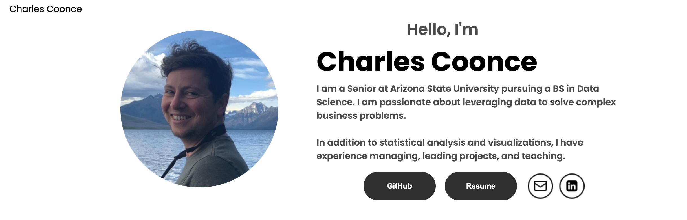
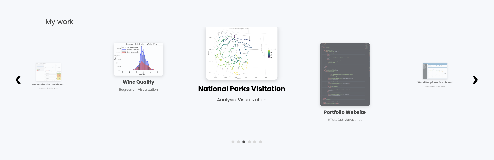
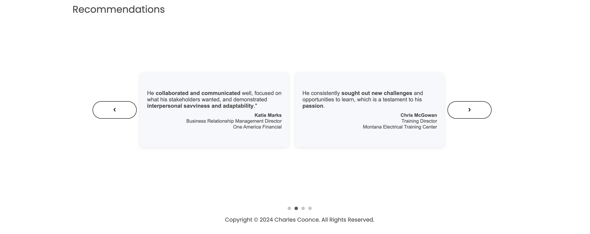

# Portfolio Website

Welcome to the repository for my personal portfolio website! This website showcases my skills, projects, and experience as a data scientist and business analyst. It's designed to highlight my work and serve as a platform for potential employers, collaborators, and fellow developers.

## 🌐 Live Website

[Visit My Portfolio](https://charleslikesdata.com/)

---

## 🚀 Features

- **Responsive Design**: Optimized for all devices, from desktops to smartphones.
- **Profile Section**: Contains links for my Github, LinkedIn, resume, and e-mail address.
- **Projects Section**: Highlights key projects using a carousel style interface I designed, and links to source code or live demos.
- **Recommendations Section**: Includes a number of proffesional reccomendations with a card deck style design.

---

## 🛠️ Technologies Used

- **Frontend**: HTML, CSS, JavaScript
- **Styling**: Custom CSS with a focus on clean and minimalist design
- **Version Control**: Git and GitHub

---

## 📂 Repository Structure

📁 portfolio-website

| 📁 projects

| ── 📁 Webcontent

|  &nbsp;  ├── 📁 assets

|  &nbsp;  ├── 📁 css

│  &nbsp;  └── 📁 js

| ── index.html

└ ── README.md

- **assets/**: Contains images, stylesheets, and JavaScript files.
- **projects/**: Holds data or assets for individual project pages.
- **index.html**: The main entry point for the portfolio.

---

## 📸 Screenshots

### Home Page

### Projects Section

### Recommendations Section

---

## 📬 Contact

Feel free to reach out if you'd like to collaborate or learn more about my work:

- **Email**: [charlescoonce@gmail.com](mailto:charlescoonce@gmail.com)
- **LinkedIn**: [My LinkedIn Profile](https://www.linkedin.com/in/your-profile)

---
