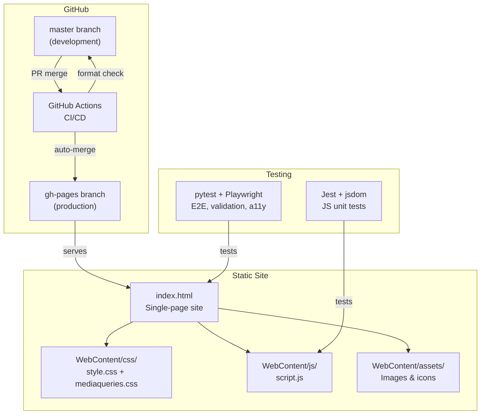
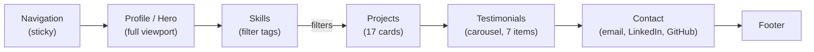
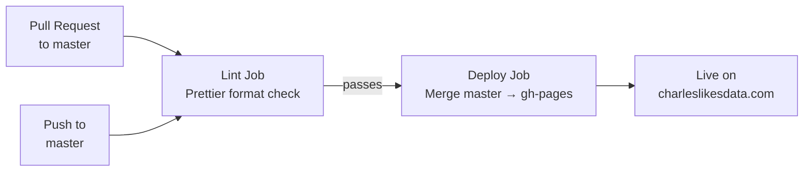

# Charles Coonce — Data Analytics Portfolio

     

A **single-page static portfolio** showcasing data science, analytics engineering, and software development projects. Built with vanilla HTML5, CSS3, and JavaScript — no frameworks, no build tools.

**Live site:** [charleslikesdata.com](https://charleslikesdata.com)

---

## Table of Contents

- [Overview](#overview)
- [Architecture](#architecture)
  - [High-Level Architecture](#high-level-architecture)
  - [Site Sections](#site-sections)
  - [Folder Structure](#folder-structure)
  - [CI/CD Pipeline](#cicd-pipeline)
- [Getting Started](#getting-started)
  - [Prerequisites](#prerequisites)
  - [Installation](#installation)
  - [Running the Dev Server](#running-the-dev-server)
- [Available Commands](#available-commands)
- [Testing](#testing)
- [Code Standards](#code-standards)
  - [Formatting](#formatting)
  - [HTML](#html)
  - [CSS](#css)
  - [JavaScript](#javascript)
- [Branching & Deployment](#branching--deployment)
  - [Branch Naming](#branch-naming)
  - [Commit Messages](#commit-messages)
  - [Deploying](#deploying)
- [Featured Projects](#featured-projects)
- [Contact](#contact)
- [License](#license)

---

## Overview

A personal portfolio for **Charles Coonce** — a data analytics professional. The site is a single `index.html` page hosted on **GitHub Pages** with a custom domain.

Key features:

- **Filterable project gallery** — multi-select skill tags filter 17 project cards using OR logic
- **Testimonial carousel** — 7 testimonials with auto-scroll, dot pagination, and responsive layout (2 on desktop, 1 on mobile)
- **Responsive design** — breakpoints at 1250px (tablet) and 700px (mobile) with a hamburger nav
- **Accessibility** — ARIA attributes, keyboard navigation, focus-visible outlines, screen-reader text

---

## Architecture

### High-Level Architecture


```mermaid
graph TD
    subgraph "GitHub"
        MASTER["master branch<br/>(development)"]
        GHPAGES["gh-pages branch<br/>(production)"]
        ACTIONS["GitHub Actions<br/>CI/CD"]
    end

    subgraph "Static Site"
        HTML["index.html<br/>Single-page site"]
        CSS["WebContent/css/<br/>style.css + mediaqueries.css"]
        JS["WebContent/js/<br/>script.js"]
        ASSETS["WebContent/assets/<br/>Images & icons"]
    end

    subgraph "Testing"
        JEST["Jest + jsdom<br/>JS unit tests"]
        PYTEST["pytest + Playwright<br/>E2E, validation, a11y"]
    end

    MASTER -->|"PR merge"| ACTIONS
    ACTIONS -->|"format check"| MASTER
    ACTIONS -->|"auto-merge"| GHPAGES
    GHPAGES -->|"serves"| HTML
    HTML --> CSS
    HTML --> JS
    HTML --> ASSETS
    JEST -->|"tests"| JS
    PYTEST -->|"tests"| HTML
```

### Site Sections


```mermaid
graph LR
    NAV["Navigation<br/>(sticky)"] --> PROFILE["Profile / Hero<br/>(full viewport)"]
    PROFILE --> SKILLS["Skills<br/>(filter tags)"]
    SKILLS -->|"filters"| PROJECTS["Projects<br/>(17 cards)"]
    PROJECTS --> TESTIMONIALS["Testimonials<br/>(carousel, 7 items)"]
    TESTIMONIALS --> CONTACT["Contact<br/>(email, LinkedIn, GitHub)"]
    CONTACT --> FOOTER["Footer"]
```

### Folder Structure

```
PortfolioWebsite/
├── index.html                 # Single-page site
├── 404.html                   # Custom 404 page
├── CNAME                      # GitHub Pages custom domain
├── package.json               # npm scripts and dev dependencies
├── pyproject.toml             # Python test dependencies (managed by uv)
├── Makefile                   # Unified test/lint runner
├── .editorconfig              # Editor formatting rules
├── .prettierrc                # Prettier configuration
├── eslint.config.mjs          # ESLint configuration
├── .stylelintrc.json          # Stylelint configuration
├── WebContent/
│   ├── assets/                # Images, icons, project screenshots
│   ├── css/
│   │   ├── style.css          # Global styles (598 lines)
│   │   └── mediaqueries.css   # Responsive breakpoints (177 lines)
│   └── js/
│       └── script.js          # All interactivity (310 lines)
├── __tests__/                 # Jest unit tests (JS)
├── tests/                     # pytest suite (validation, a11y, E2E)
├── docs/
│   ├── plans/                 # Implementation plans
│   └── reviews/               # Code review reports
└── .github/workflows/
    └── ci-cd.yml              # GitHub Actions pipeline
```

### CI/CD Pipeline


```mermaid
flowchart LR
    PR["Pull Request<br/>to master"] --> LINT["Lint Job<br/>Prettier format check"]
    PUSH["Push to<br/>master"] --> LINT
    LINT -->|"passes"| DEPLOY["Deploy Job<br/>Merge master → gh-pages"]
    DEPLOY --> LIVE["Live on<br/>charleslikesdata.com"]
```

The pipeline runs on every PR and push to `master`:

1. **Lint job** — installs Node.js 20, runs `npm run format:check` (Prettier)
2. **Deploy job** — merges `master` into `gh-pages` (only on push to `master`, after lint passes)

Uses the built-in `GITHUB_TOKEN` — no external secrets required.

---

## Getting Started

### Prerequisites

- **Git**
- **Node.js 20+** and **npm** (for formatting, linting, and Jest tests)
- **Python 3.11+** and [**uv**](https://docs.astral.sh/uv/) (for pytest suite)
- A modern browser

### Installation

1. **Clone the repository:**

   ```bash
   git clone https://github.com/cdcoonce/Portfolio_Website.git
   cd Portfolio_Website
   ```

2. **Install Node dependencies:**

   ```bash
   npm install
   ```

3. **Install Python test dependencies:**

   ```bash
   uv sync
   uv run playwright install chromium
   ```

### Running the Dev Server

```bash
npm run serve
# → http://localhost:8000
```

> The site is fully static — you can also open `index.html` directly in a browser.

---

## Available Commands

| Command                | Description                                   |
| ---------------------- | --------------------------------------------- |
| `npm run serve`        | Start local dev server on port 8000           |
| `npm run format`       | Auto-format HTML, CSS, JS, MD, and JSON files |
| `npm run format:check` | Check formatting without modifying files      |
| `npm test`             | Run Jest unit tests                           |
| `npm run lint:css`     | Lint CSS with Stylelint                       |
| `npm run lint:js`      | Lint JS with ESLint                           |
| `npm run lint`         | Run all linters                               |
| `uv run pytest`        | Run Python test suite (validation, a11y, E2E) |
| `make check`           | Full suite — lint + JS tests + Python tests   |
| `make test-a11y`       | Accessibility tests only                      |
| `make test-e2e`        | End-to-end browser tests only                 |

---

## Testing

The project uses a two-layer test strategy:

| Layer                 | Tool                    | What it covers                                       |
| --------------------- | ----------------------- | ---------------------------------------------------- |
| **JS Unit Tests**     | Jest + jsdom            | Filter logic, carousel state, utilities              |
| **HTML Validation**   | pytest + BeautifulSoup  | Semantic markup, alt text, card structure            |
| **Accessibility**     | pytest + axe-playwright | WCAG 2.1 AA compliance, ARIA attributes, focus order |
| **E2E Browser Tests** | pytest + Playwright     | Navigation, gallery filtering, carousel interaction  |
| **Visual Regression** | pytest + Playwright     | Screenshot comparison at breakpoints                 |

Run the full suite:

```bash
make check
```

---

## Code Standards

### Formatting

Enforced via `.editorconfig` and `.prettierrc`:

- **Indentation:** 2 spaces
- **Line width:** 100 characters
- **Quotes:** Single quotes (JS)
- **Semicolons:** Required
- **Line endings:** LF
- **Encoding:** UTF-8

### HTML

- Semantic elements (`<header>`, `<nav>`, `<section>`, `<footer>`)
- Descriptive `alt` text on all images
- `<button>` for interactive controls
- No inline styles or inline JavaScript

### CSS

- BEM naming convention (`.block__element--modifier`)
- Mobile-first responsive approach
- Media queries at 1250px (tablet) and 700px (mobile)

### JavaScript

- `'use strict';` at the top of every file
- `const` by default, `let` when needed, never `var`
- Descriptive function and variable names
- Guard clauses for missing DOM elements

---

## Branching & Deployment

This project uses a two-branch model:

| Branch     | Purpose                                              |
| ---------- | ---------------------------------------------------- |
| `master`   | Development — all feature branches merge here        |
| `gh-pages` | Production — merging `master` here triggers a deploy |

### Branch Naming

```text
feature/add-tableau-project
fix/broken-resume-link
chore/update-dependencies
docs/update-readme
```

### Commit Messages

Follows [Conventional Commits](https://www.conventionalcommits.org/):

```text
feat(gallery): add Manufacturing Downtime Analysis project card
fix(carousel): correct wraparound past last testimonial
test(nav): add E2E tests for hamburger menu toggle
docs(readme): update local development instructions
```

**Types:** `feat`, `fix`, `refactor`, `style`, `test`, `docs`, `chore`, `build`
**Scopes:** `gallery`, `carousel`, `hero`, `nav`, `footer`, `a11y`, `ci`, `deps`

### Deploying

Deployment is fully automated. Every merge into `master` triggers GitHub Actions to merge `master` → `gh-pages`, which GitHub Pages serves as the live site. No manual steps required.

---

## Featured Projects

| Project                                   | Tools                      |
| ----------------------------------------- | -------------------------- |
| National Parks Dashboard                  | Tableau, Python            |
| Wine Quality Analysis                     | Python, Pandas, Matplotlib |
| Manufacturing Downtime Analysis           | SQL, Power BI              |
| NYC Collision Analysis                    | Python, Folium             |
| Global CO2 Emissions                      | Tableau                    |
| Spaceship Titanic Classification          | Python, scikit-learn       |
| Housing Affordability & Commute Tradeoffs | Python, GeoPandas          |
| AirBnB Listing Analysis                   | SQL, Python                |
| World Happiness Dashboard                 | Tableau                    |
| Sleep Deprivation Analysis                | R, ggplot2                 |

Full project details and live demos on [charleslikesdata.com](https://charleslikesdata.com).

---

## Contact

**Charles Coonce**

- Email: [charles.coonce@gmail.com](mailto:charles.coonce@gmail.com)
- LinkedIn: [linkedin.com/in/charlescoonce](https://www.linkedin.com/in/charlescoonce/)
- GitHub: [github.com/cdcoonce](https://github.com/cdcoonce)

---

## License

All rights reserved. &copy; 2026 Charles Coonce.

This repository is for a personal portfolio site. The code may be referenced for learning purposes, but may not be copied or repurposed for commercial use without permission.
