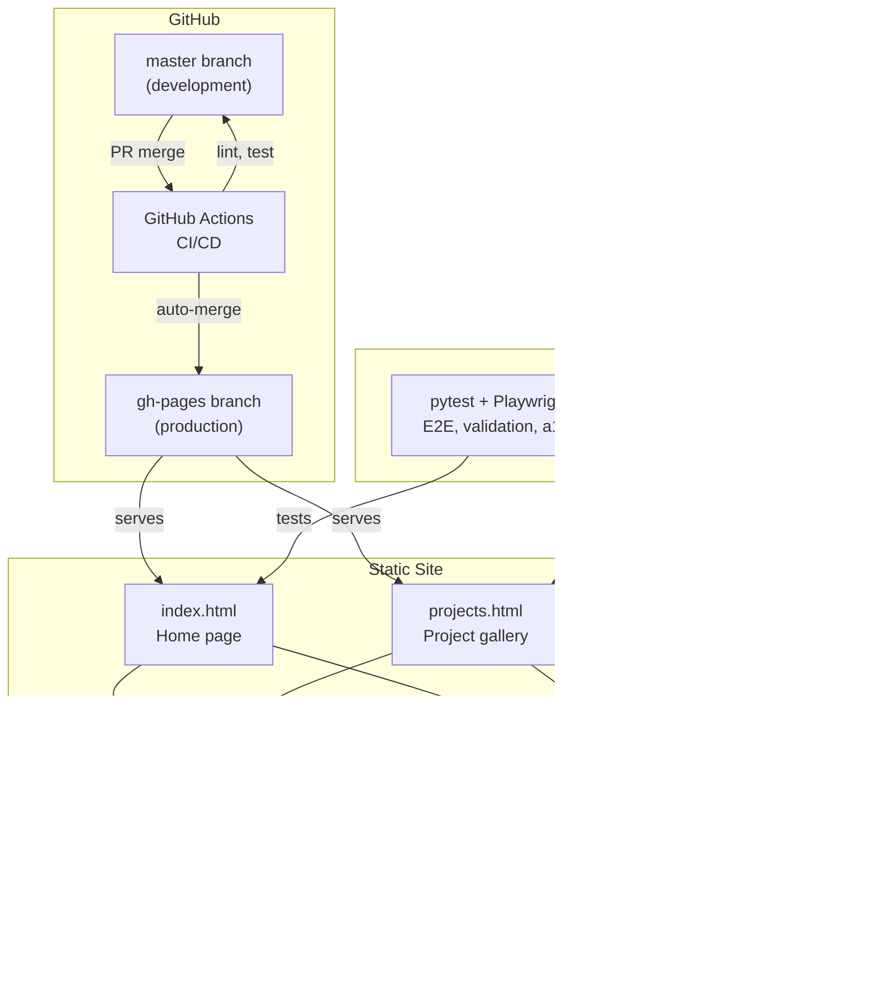
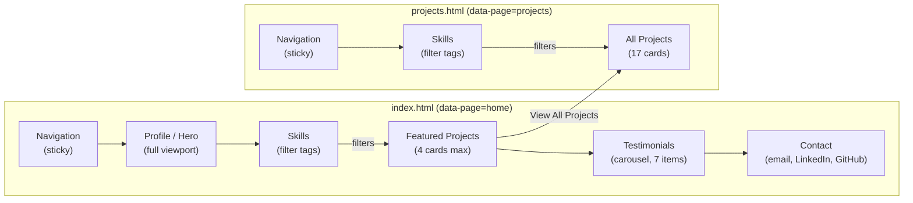
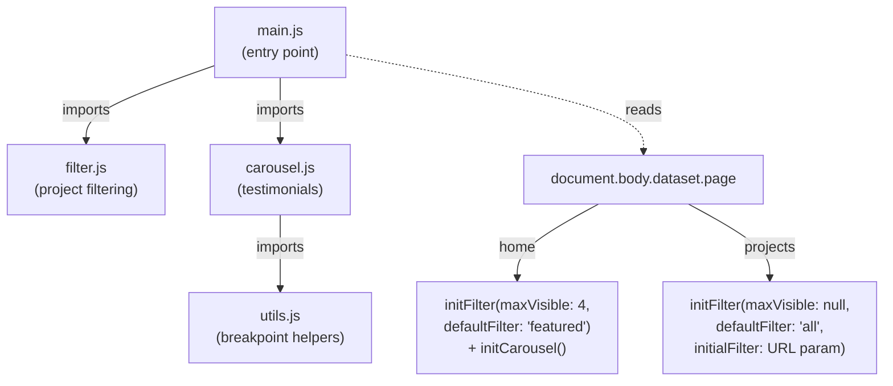
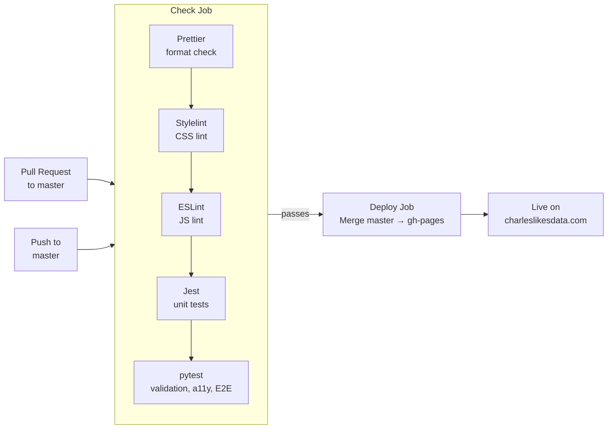

# Charles Coonce — Portfolio

     

A **multi-page static portfolio** built with vanilla HTML5, CSS3, and ES module JavaScript — no frameworks, no bundlers, no build step. The homepage highlights four featured projects with a filterable skills grid, while a dedicated gallery page showcases all 17 projects with URL-driven filtering and deep-link support.

**Live site:** [charleslikesdata.com](https://charleslikesdata.com)

---

## Table of Contents

- [Overview](#overview)
- [Architecture](#architecture)
  - [High-Level Architecture](#high-level-architecture)
  - [Page Structure](#page-structure)
  - [Module Dependency Graph](#module-dependency-graph)
  - [Folder Structure](#folder-structure)
  - [CI/CD Pipeline](#cicd-pipeline)
- [Getting Started](#getting-started)
  - [Prerequisites](#prerequisites)
  - [Installation](#installation)
  - [Running the Dev Server](#running-the-dev-server)
- [Available Commands](#available-commands)
- [Testing](#testing)
- [Code Standards](#code-standards)
  - [Formatting](#formatting)
  - [HTML](#html)
  - [CSS](#css)
  - [JavaScript](#javascript)
- [Branching & Deployment](#branching--deployment)
  - [Branch Naming](#branch-naming)
  - [Commit Messages](#commit-messages)
  - [Deploying](#deploying)
- [Projects](#projects)
- [Contact](#contact)
- [License](#license)

---

## Overview

A personal portfolio for **Charles Coonce** — a data analytics professional. The site is hosted on **GitHub Pages** with a custom domain and organized across multiple pages:

| Page | Route | Purpose |
| --- | --- | --- |
| **Home** | `/` | Hero profile, 4 featured project cards, testimonial carousel, contact links |
| **All Projects** | `/projects.html` | Full gallery of 17 project cards with skill-tag filtering |
| **404** | `/404.html` | Custom error page |

Key features:

- **Featured project cards** — the homepage surfaces 4 highlighted projects; the gallery page displays all 17
- **Skill-tag filtering** — single-select filter buttons narrow project cards by technology (Python, SQL, R, Tableau, etc.) with OR-match logic
- **URL-driven filters** — link to `projects.html?filter=python` to pre-select a skill filter on page load
- **Testimonial carousel** — 7 recommendations with auto-scroll (20 s), dot pagination, and responsive layout (2 on desktop, 1 on mobile)
- **Responsive design** — breakpoints at 1250 px (tablet) and 700 px (mobile) with hamburger navigation
- **Accessibility** — WCAG 2.1 AA compliance, ARIA attributes, keyboard navigation, focus-visible outlines, screen-reader text

---

## Architecture

### High-Level Architecture


```mermaid
graph TD
    subgraph "GitHub"
        MASTER["master branch<br/>(development)"]
        GHPAGES["gh-pages branch<br/>(production)"]
        ACTIONS["GitHub Actions<br/>CI/CD"]
    end

    subgraph "Static Site"
        INDEX["index.html<br/>Home page"]
        PROJECTS["projects.html<br/>Project gallery"]
        CSS["WebContent/css/<br/>style.css + mediaqueries.css"]
        JS["WebContent/js/<br/>main.js, filter.js,<br/>carousel.js, utils.js"]
        ASSETS["WebContent/assets/<br/>Images & icons"]
    end

    subgraph "Testing"
        JEST["Jest + jsdom<br/>JS unit tests"]
        PYTEST["pytest + Playwright<br/>E2E, validation, a11y"]
    end

    MASTER -->|"PR merge"| ACTIONS
    ACTIONS -->|"lint, test"| MASTER
    ACTIONS -->|"auto-merge"| GHPAGES
    GHPAGES -->|"serves"| INDEX
    GHPAGES -->|"serves"| PROJECTS
    INDEX --> CSS
    INDEX --> JS
    PROJECTS --> CSS
    PROJECTS --> JS
    JS --> ASSETS
    JEST -->|"tests"| JS
    PYTEST -->|"tests"| INDEX
    PYTEST -->|"tests"| PROJECTS
```

### Page Structure


```mermaid
graph LR
    subgraph "index.html (data-page=home)"
        NAV1["Navigation<br/>(sticky)"] --> HERO["Profile / Hero<br/>(full viewport)"]
        HERO --> SKILLS1["Skills<br/>(filter tags)"]
        SKILLS1 -->|"filters"| CARDS1["Featured Projects<br/>(4 cards max)"]
        CARDS1 --> TEST["Testimonials<br/>(carousel, 7 items)"]
        TEST --> CONTACT["Contact<br/>(email, LinkedIn, GitHub)"]
    end

    CARDS1 -->|"View All Projects"| GALLERY

    subgraph "projects.html (data-page=projects)"
        NAV2["Navigation<br/>(sticky)"] --> SKILLS2["Skills<br/>(filter tags)"]
        SKILLS2 -->|"filters"| GALLERY["All Projects<br/>(17 cards)"]
    end
```

### Module Dependency Graph


```mermaid
graph TD
    MAIN["main.js<br/>(entry point)"] -->|"imports"| FILTER["filter.js<br/>(project filtering)"]
    MAIN -->|"imports"| CAROUSEL["carousel.js<br/>(testimonials)"]
    CAROUSEL -->|"imports"| UTILS["utils.js<br/>(breakpoint helpers)"]

    MAIN -.->|"reads"| PAGE["document.body.dataset.page"]
    PAGE -->|"home"| HOME_CFG["initFilter(maxVisible: 4,<br/>defaultFilter: 'featured')<br/>+ initCarousel()"]
    PAGE -->|"projects"| PROJ_CFG["initFilter(maxVisible: null,<br/>defaultFilter: 'all',<br/>initialFilter: URL param)"]
```

Each module exports **pure functions** (no side effects) for testability, plus one `init*()` orchestrator that wires them to the DOM.

### Folder Structure

```
PortfolioWebsite/
├── index.html                 # Home — hero, 4 featured projects, carousel, contact
├── projects.html              # Gallery — all 17 projects, full filtering
├── 404.html                   # Custom 404 page
├── CNAME                      # GitHub Pages custom domain
├── package.json               # npm scripts and dev dependencies
├── pyproject.toml             # Python test dependencies (managed by uv)
├── Makefile                   # Unified test/lint runner
├── .editorconfig              # Editor formatting rules
├── .prettierrc                # Prettier configuration
├── eslint.config.mjs          # ESLint configuration (flat config)
├── .stylelintrc.json          # Stylelint configuration
├── jest.config.js             # Jest environment (jsdom, ES modules)
├── WebContent/
│   ├── assets/                # Project screenshots, icons, profile photo, resume
│   ├── css/
│   │   ├── style.css          # Global styles & custom properties (629 lines)
│   │   └── mediaqueries.css   # Responsive breakpoints (185 lines)
│   └── js/
│       ├── main.js            # Entry point — page detection, component init (82 lines)
│       ├── filter.js          # Project card filtering & visibility logic (158 lines)
│       ├── carousel.js        # Testimonial carousel & pagination (191 lines)
│       └── utils.js           # Viewport breakpoint helpers (20 lines)
├── __tests__/                 # Jest unit tests (JS)
│   ├── filter.test.js         # Filter pure function tests
│   ├── carousel.test.js       # Carousel pure function tests
│   └── utils.test.js          # Utility function tests
├── tests/                     # pytest suite (validation, a11y, E2E)
│   ├── conftest.py            # Shared fixtures (HTTP server, Playwright browser)
│   ├── test_validation.py     # HTML structure & semantic markup
│   ├── test_gallery.py        # Project filtering E2E
│   ├── test_carousel.py       # Carousel interaction E2E
│   ├── test_accessibility.py  # WCAG 2.1 AA (axe-core)
│   ├── test_nav.py            # Navigation & hamburger menu
│   ├── test_hero.py           # Hero section & skills grid
│   ├── test_seo.py            # Meta tags & Open Graph
│   ├── test_links.py          # External link health checks
│   └── test_responsive.py     # Visual regression (stub)
├── docs/
│   ├── plans/                 # Implementation plans
│   └── reviews/               # Code review reports
└── .github/workflows/
    └── ci-cd.yml              # GitHub Actions pipeline
```

### CI/CD Pipeline


```mermaid
flowchart LR
    PR["Pull Request<br/>to master"] --> CHECK
    PUSH["Push to<br/>master"] --> CHECK

    subgraph CHECK["Check Job"]
        FMT["Prettier<br/>format check"] --> STYLE["Stylelint<br/>CSS lint"]
        STYLE --> ESLINT["ESLint<br/>JS lint"]
        ESLINT --> JEST["Jest<br/>unit tests"]
        JEST --> PY["pytest<br/>validation, a11y, E2E"]
    end

    CHECK -->|"passes"| DEPLOY["Deploy Job<br/>Merge master → gh-pages"]
    DEPLOY --> LIVE["Live on<br/>charleslikesdata.com"]
```

The pipeline runs on every PR and push to `master`:

1. **Check job** — Node.js 20 + Python 3.12 + Playwright Chromium
   - **Prettier** format check
   - **Stylelint** CSS linting
   - **ESLint** JS linting
   - **Jest** unit tests (filter, carousel, utils)
   - **pytest** integration tests (validation, accessibility, E2E — excludes `@pytest.mark.slow`)
2. **Deploy job** — merges `master` into `gh-pages` (only on push to `master`, after check passes)

Uses the built-in `GITHUB_TOKEN` — no external secrets required.

---

## Getting Started

### Prerequisites

- **Git**
- **Node.js 20+** and **npm** (for formatting, linting, and Jest tests)
- **Python 3.11+** and [**uv**](https://docs.astral.sh/uv/) (for pytest suite)
- A modern browser

### Installation

1. **Clone the repository:**

   ```bash
   git clone https://github.com/cdcoonce/Portfolio_Website.git
   cd Portfolio_Website
   ```

2. **Install Node dependencies:**

   ```bash
   npm install
   ```

3. **Install Python test dependencies:**

   ```bash
   uv sync
   uv run playwright install chromium
   ```

### Running the Dev Server

```bash
npm run serve
# → http://localhost:8000
```

> The site is fully static — you can also open `index.html` directly in a browser. Navigate to `projects.html` for the full gallery.

---

## Available Commands

| Command | Description |
| --- | --- |
| `npm run serve` | Start local dev server on port 8000 |
| `npm run format` | Auto-format HTML, CSS, JS, MD, and JSON files |
| `npm run format:check` | Check formatting without modifying files |
| `npm test` | Run Jest unit tests |
| `npm run test:coverage` | Run Jest with coverage report |
| `npm run lint:css` | Lint CSS with Stylelint |
| `npm run lint:js` | Lint JS with ESLint |
| `npm run lint` | Run all linters (Stylelint + ESLint) |
| `uv run pytest` | Run Python test suite (validation, a11y, E2E) |
| `make check` | Full suite — lint + JS tests + Python tests |
| `make test-a11y` | Accessibility tests only |
| `make test-e2e` | End-to-end browser tests only |
| `make test-js` | Jest unit tests only |

---

## Testing

The project uses a two-layer test strategy:

| Layer | Tool | What it covers |
| --- | --- | --- |
| **JS Unit Tests** | Jest + jsdom | Filter logic, carousel state, viewport utilities |
| **HTML Validation** | pytest + BeautifulSoup | Semantic markup, alt text, card structure, featured flags |
| **Accessibility** | pytest + axe-playwright | WCAG 2.1 AA compliance, ARIA attributes, focus order |
| **E2E Browser Tests** | pytest + Playwright | Navigation, gallery filtering, carousel interaction, URL params |
| **Visual Regression** | pytest + Playwright | Screenshot comparison at breakpoints (stub) |

Run the full suite:

```bash
make check
```

---

## Code Standards

### Formatting

Enforced via `.editorconfig` and `.prettierrc`:

- **Indentation:** 2 spaces
- **Line width:** 100 characters
- **Quotes:** Single quotes (JS)
- **Semicolons:** Required
- **Line endings:** LF
- **Encoding:** UTF-8

### HTML

- Semantic elements (`<header>`, `<nav>`, `<section>`, `<footer>`)
- Descriptive `alt` text on all images
- `<button>` for interactive controls
- `data-page` attribute on `<body>` for page-aware JS initialization
- `data-tags` on project cards for filter targeting
- No inline styles or inline JavaScript

### CSS

- CSS custom properties for the color palette (`:root` variables)
- Mobile-first responsive approach
- Media queries at 1250 px (tablet) and 700 px (mobile)
- Stylelint with `stylelint-config-standard`

### JavaScript

- ES modules (`type="module"` — strict mode by default)
- `const` by default, `let` when needed, never `var`
- Pure functions for all business logic; `init*()` orchestrators for DOM wiring
- Guard clauses for missing DOM elements
- ESLint with `eqeqeq`, `no-var`, `prefer-const`

---

## Branching & Deployment

This project uses a two-branch model:

| Branch | Purpose |
| --- | --- |
| `master` | Development — all feature branches merge here |
| `gh-pages` | Production — auto-merged from `master` by CI; served by GitHub Pages |

### Branch Naming

```text
feat/add-tableau-project
fix/broken-resume-link
chore/update-dependencies
docs/update-readme
```

### Commit Messages

Follows [Conventional Commits](https://www.conventionalcommits.org/):

```text
feat(gallery): add Manufacturing Downtime Analysis project card
fix(carousel): correct wraparound past last testimonial
test(nav): add E2E tests for hamburger menu toggle
docs(readme): update local development instructions
```

**Types:** `feat`, `fix`, `refactor`, `style`, `test`, `docs`, `chore`, `build`
**Scopes:** `gallery`, `carousel`, `hero`, `nav`, `footer`, `a11y`, `ci`, `deps`

### Deploying

Deployment is fully automated. Every merge into `master` triggers GitHub Actions to merge `master` → `gh-pages`, which GitHub Pages serves as the live site. No manual steps required.

---

## Projects

All 17 project cards displayed on the site:

| # | Project | Technologies |
| --- | --- | --- |
| 1 | **National Parks Dashboard** ⭐ | R, Shiny, Data Visualization |
| 2 | **Wine Quality Analysis** ⭐ | Python, Machine Learning, Statistical Analysis |
| 3 | **Manufacturing Downtime Analysis** ⭐ | Excel, Business Intelligence, Analytics Dashboard |
| 4 | **Housing Affordability & Commute Analysis** ⭐ | Python, ETL, Machine Learning, Data Pipelines, Visualization |
| 5 | Electricity Consumption | Python, ETL, Data Visualization |
| 6 | National Parks Analysis | R, Statistical Analysis, Data Visualization |
| 7 | Portfolio Website | HTML, CSS, JavaScript |
| 8 | World Happiness Dashboard | R, Shiny, Data Visualization |
| 9 | Data Archive | Python, ETL, Data Pipelines |
| 10 | NYC Collision Analysis | Excel, Business Intelligence, Data Visualization |
| 11 | Global CO2 Emissions | Tableau, Analytics Dashboard, Data Visualization |
| 12 | AirBnB Listing Analysis | Python, ETL, Statistical Analysis |
| 13 | Sleep Deprivation Analysis | Python, ETL, Statistical Analysis |
| 14 | Restaurant Order Analysis | SQL, Business Intelligence |
| 15 | Motor Vehicle Thefts | SQL, Excel, Data Visualization |
| 16 | Baby Names Analysis | SQL, Data Visualization |
| 17 | Spaceship Titanic | Python, Machine Learning |

⭐ = Featured on the homepage

Full project details and live demos at [charleslikesdata.com](https://charleslikesdata.com).

---

## Contact

**Charles Coonce**

- Email: [charles.coonce@gmail.com](mailto:charles.coonce@gmail.com)
- LinkedIn: [linkedin.com/in/charlescoonce](https://www.linkedin.com/in/charlescoonce/)
- GitHub: [github.com/cdcoonce](https://github.com/cdcoonce)

---

## License

All rights reserved. &copy; 2026 Charles Coonce.

This repository is for a personal portfolio site. The code may be referenced for learning purposes, but may not be copied or repurposed for commercial use without permission.
