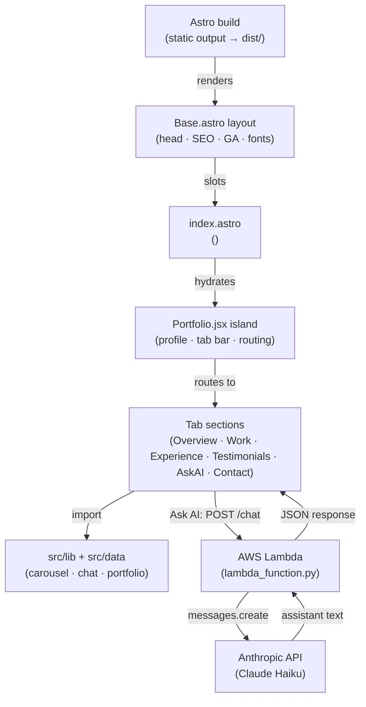
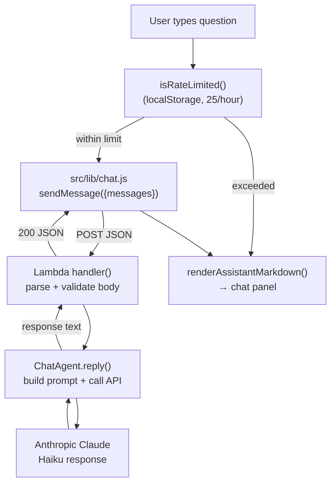

# Architecture

<!-- generated:start -->
## System Architecture

The portfolio is an **Astro** app built with **static output** — every page is pre-rendered to plain HTML at build time (`npm run build` → `dist/`). Interactivity ships as **React islands** via `@astrojs/react`, so JavaScript is hydrated only where it's needed. The entire interactive UI is a single island: `src/pages/index.astro` mounts `<Portfolio client:load />`, a tabbed **single-page experience** that hydrates in the **browser** and swaps between the Overview, Work, Experience, Testimonials, Ask AI, and Contact sections with React state (no router, no page reloads). The **Ask AI** tab calls an AWS Lambda function that proxies to the Anthropic Claude API.

### System Components



### Ask AI Data Flow



## Source Layout

| Path | Contents |
|---|---|
| `src/pages/` | Astro pages — `index.astro` (home), `404.astro` |
| `src/layouts/` | `Base.astro` — `<head>`, SEO/Open Graph, Google Analytics, fonts |
| `src/components/` | React islands — `Portfolio.jsx`, `Button.jsx`, `Tag.jsx`, `ProjectCard.jsx` |
| `src/components/tabs/` | Tab sections — `Overview`, `Work`, `Experience`, `Testimonials`, `AskAI`, `Contact` |
| `src/lib/` | Framework-free logic — `carousel.js` (index math), `chat.js` (Lambda client + rate limiting) |
| `src/data/` | `portfolio.js` — projects, skills, metrics, experience, testimonials, navItems |
| `src/styles/` | `tokens.css` (design tokens) + `global.css` (component styles) |
| `lambda/` | AWS Lambda chat backend (unchanged) |

## Deploy Model

Two branches, two hosts. `dev` is **live staging**; `main` is **production**. Each push builds the Astro site and publishes the `dist/` output to a different host.

| Branch | Trigger | Host | URL |
|---|---|---|---|
| `main` | push (after lint + test + build) | GitHub Pages (`gh-pages` branch) | charleslikesdata.com |
| `dev` | push | Cloudflare Pages (`charleslikesdata-portfolio`) | charleslikesdata-portfolio.pages.dev |

Promotion flows `dev → main`: work lands on `dev` (auto-deployed to staging), then merges to `main` for production. See the CI/CD Pipeline page for the workflow details.
<!-- generated:end -->

<!-- claude:prose -->
## Frontend Module Architecture

The frontend is split into seven ES modules, each with a single responsibility. `main.js` is the only entry point — it imports all other modules and wires them to the DOM after `DOMContentLoaded`. No module except `main.js` touches the DOM directly at import time; all side effects are deferred to initializer functions (`initFilter`, `initCarousel`, `initChat`). This makes every module independently testable with Jest by calling the exported pure functions directly.

### Module Responsibilities

**`projects.js`** is the single source of truth for all project data and the tag registry. It exports the `projects` array (one object per project with `id`, `href`, `title`, `date`, `description`, `image`, `tags`, and optional `featured`/`imageContain` fields), the derived `tags` set (union of all tags across all projects, deduplicated), `TAG_LABELS` (display names for tags), and `TAG_CATEGORIES` (the curated groupings shown in the skills grid). Nothing in the codebase hardcodes a tag string outside this module — the rest of the system derives tag state from `projects.js` at runtime.

**`renderer.js`** constructs project cards and filter buttons as DOM elements, never via `innerHTML`. `createProjectCard` builds a full `<a>` element programmatically, sets `data-tags` and `data-date` attributes used later by `filter.js`, and delegates date formatting to `utils.formatProjectDate`. `renderFilterButtons` generates a `.skills-grid` with named category groups; any tag present in `allTags` but not assigned to a curated category is automatically collected into an "Other" group, so new projects with novel tags are always filterable.

**`filter.js`** manages project card visibility. The core design is purely functional: `getFilteredVisibility`, `applyMaxVisible`, `getFeaturedVisibility`, and `getSortedIndices` are all pure functions that take arrays and return arrays — no DOM access. `initFilter` is the orchestrator that reads the DOM, attaches event listeners, and calls those pure functions to compute which cards to show or hide. The filter system is single-select (clicking an active filter deselects it and returns to the default state). On the homepage (`defaultFilter: 'featured'`), the default view shows only the four featured projects; on the projects page (`defaultFilter: 'all'`), all cards are shown. The `knownTags` guard warns in the console if a filter button's `data-filter` value doesn't correspond to any project, catching stale or misspelled tags early.

**`carousel.js`** drives the testimonials carousel. It shows one testimonial on mobile and two on desktop (threshold: 1250 px, matching `mediaqueries.css`). All index arithmetic — next/previous with wraparound, dot count, active dot index, counter text — is extracted into pure exported functions. The auto-scroll timer (`setInterval` at 20 s) is paused when the page is hidden (`visibilitychange` event) and resumed on focus, preventing background tabs from burning CPU. The timer reference is reassigned on resume rather than re-initialized with a new closure.

**`chat.js`** manages the conversational AI widget. It maintains a `conversationHistory` array in module scope (prefilled with the initial assistant greeting) and sends the full history to Lambda on every request, enabling multi-turn conversation. Client-side rate limiting uses `localStorage` to persist request timestamps across page loads; the window is 1 hour, the limit is 25 requests. Timestamps older than the window are discarded on each check so the limit is rolling, not fixed. User message text is escaped via a DOM `createTextNode` round-trip (the safest XSS prevention approach — no regex). Assistant responses go through a lightweight Markdown renderer that handles bold, italic, links, and bare URLs before being inserted into the DOM.

**`utils.js`** exports three pure utility functions: `getItemsToShow` (returns desktop or mobile count based on viewport width), `isDesktop` (boolean viewport check), and `formatProjectDate` (converts `'YYYY-MM'` to `'Mon YYYY'` using a local month abbreviation array — no `Intl` dependency for IE-safe formatting that predates the ES2022 module migration).

### Page-Aware Initialization

`main.js` reads `document.body.dataset.page` to detect which page it is running on. On `projects.html` (`data-page="projects"`), `initFilter` is called with `maxVisible: null` (show all) and `initialFilter: getFilterFromURL()` (pre-select filter from the URL query param, enabling deep-linked filter state). On `index.html` (no `data-page` value), `initFilter` is called with `maxVisible: 4` and `defaultFilter: 'featured'`, and `initCarousel` and `initChat` are also initialized. This avoids loading chat and carousel code paths on pages where those DOM elements don't exist.

### Dependency Graph

```text
main.js
  ├── filter.js     (getFilterFromURL, initFilter)
  ├── carousel.js   (initCarousel)
  │   └── utils.js  (getItemsToShow, isDesktop)
  ├── chat.js       (initChat)
  ├── projects.js   (projects, tags, TAG_LABELS, TAG_CATEGORIES)
  └── renderer.js   (renderProjectCards, renderFilterButtons)
      └── utils.js  (formatProjectDate)
```

`filter.js` and `chat.js` have no module-level imports from this project — they are self-contained except for browser globals (`document`, `localStorage`, `fetch`). `carousel.js` and `renderer.js` each import from `utils.js`. No module imports from `main.js`; the dependency graph is a strict tree with no cycles.

### Static Site Deployment

The site is a GitHub Pages static deployment with no build step. Every source file in `WebContent/` is the deployed file — there are no compiled artifacts, source maps, or intermediate outputs. GitHub Pages serves `index.html` from the `gh-pages` branch, which is kept in sync with `master` via the `ci-cd.yml` deploy job. CORS is not a concern for the static assets; the only cross-origin request is the Lambda call in `chat.js`, whose CORS policy is configured in AWS (not in application code).
<!-- claude:prose:end -->
