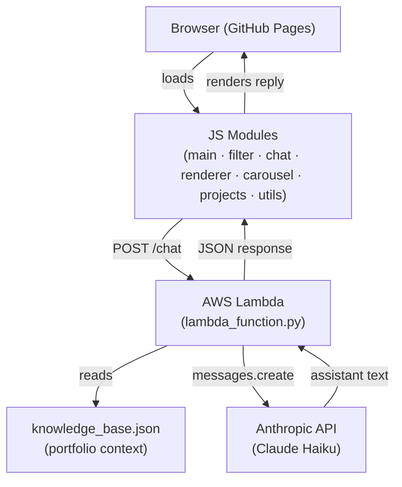
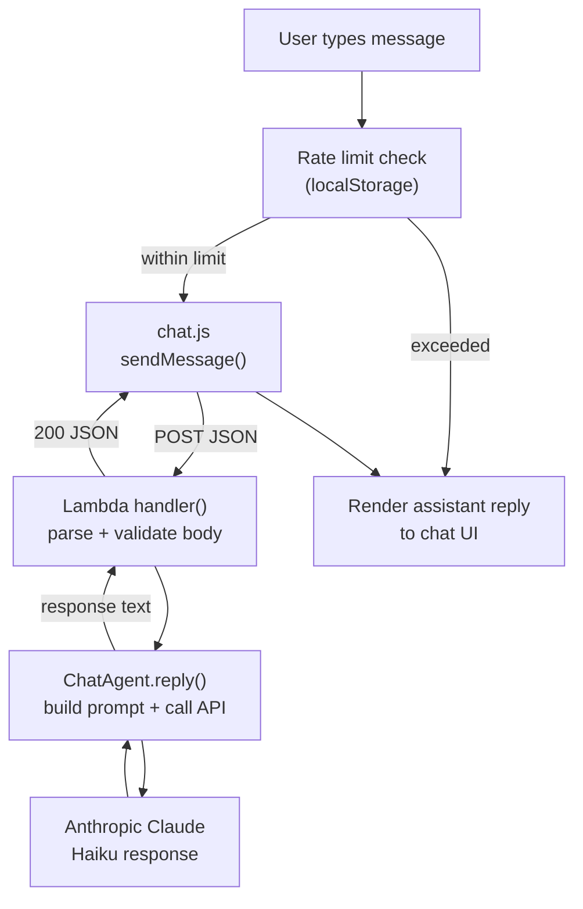

# Architecture

<!-- generated:start -->
## System Architecture

The portfolio is a static site served from GitHub Pages. Interactive features (filtering, carousel, chat) run in the browser via ES modules. The chat widget communicates with an AWS Lambda function that proxies requests to the Anthropic Claude API.

### System Components

### Chat Data Flow

## Key Files

| File | Role |
|---|---|
| `WebContent/js/main.js` | Application entry point — wires all modules |
| `WebContent/js/chat.js` | Chat widget — rate limiting, XSS protection, Lambda calls |
| `lambda/lambda_function.py` | AWS Lambda handler — ChatAgent, ChatRequest |
| `lambda/knowledge_base.json` | Portfolio context for the LLM system prompt |
| `index.html` | Main page — chat widget, projects, testimonials |
| `projects.html` | Full projects listing |
<!-- generated:end -->

<!-- claude:prose -->

<!-- claude:prose:end -->
