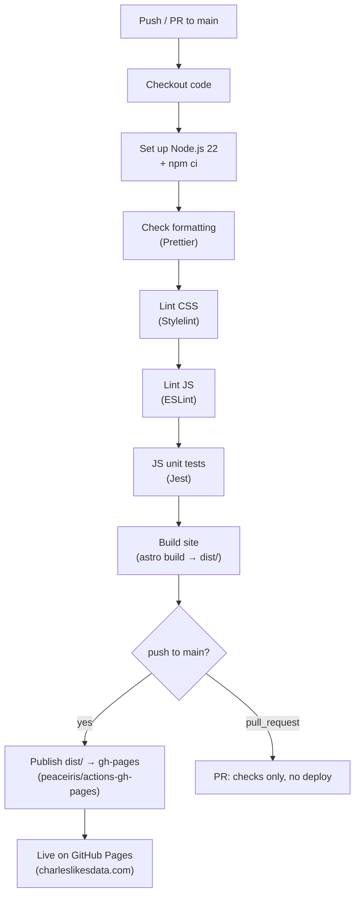
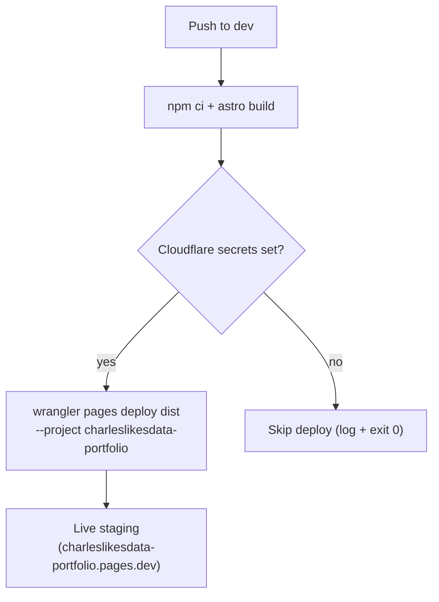
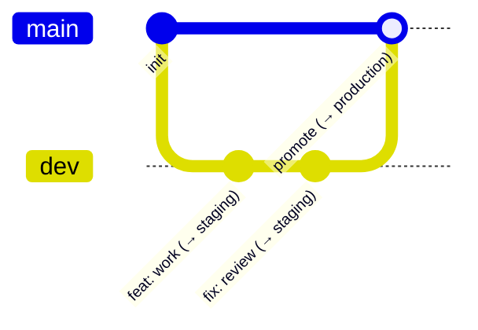

# CI-CD-Pipeline

<!-- generated:start -->
## CI/CD Pipeline

Delivery runs on GitHub Actions across **two branches, two hosts**. `dev` is **live staging** (Cloudflare Pages); `main` is **production** (GitHub Pages). Both build the Astro site (`npm run build` → `dist/`) and publish that output — the only difference is the host and the quality gate in front of it.

### Production Pipeline (`main` → GitHub Pages)

`ci-cd.yml` runs on every push and pull request targeting `main`. The **check** job must pass before the **deploy** job publishes to the `gh-pages` branch (including `CNAME`), which GitHub Pages serves.

### Staging Pipeline (`dev` → Cloudflare Pages)

`deploy-staging.yml` runs on every push to `dev`. It builds the Astro site and deploys `dist/` to the Cloudflare Pages project `charleslikesdata-portfolio` via `wrangler`. The deploy self-skips until the `CLOUDFLARE_API_TOKEN` and `CLOUDFLARE_ACCOUNT_ID` repo secrets are set, so early pushes don't fail red.

### Branch & Promotion Model

Feature work lands on `dev`, which auto-deploys to staging. Once verified, `dev` merges to `main`, which runs the full gate and promotes to production.

## Trigger Matrix

| Event | Branch | Workflow | Result |
|---|---|---|---|
| `push` | `main` | `ci-cd.yml` | Lint + Test + Build, then deploy to GitHub Pages |
| `pull_request` | `main` | `ci-cd.yml` | Lint + Test + Build only (no deploy) |
| `push` | `dev` | `deploy-staging.yml` | Build + deploy to Cloudflare Pages (staging) |

## Workflow Files

| File | Trigger | Purpose |
|---|---|---|
| `.github/workflows/ci-cd.yml` | push / PR → `main` | Lint, test, build; deploy production to `gh-pages` |
| `.github/workflows/deploy-staging.yml` | push → `dev` | Build + deploy staging to Cloudflare Pages |
| `.github/workflows/wiki-sync.yml` | push → `main` (relevant paths) | Regenerate and sync this wiki |
<!-- generated:end -->
