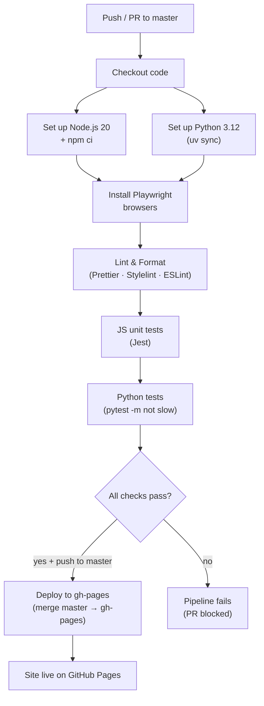

# CI-CD-Pipeline

<!-- generated:start -->
## CI/CD Pipeline

The project uses GitHub Actions for continuous integration and deployment. Every push to `master` and every pull request targeting `master` triggers the Lint & Test job. On a successful push to `master`, the Deploy job merges the branch into `gh-pages` to publish the site.

### Pipeline Flowchart



### Branch Strategy

```mermaid
gitGraph
    commit id: "initial"
    branch feature
    checkout feature
    commit id: "feat: work"
    commit id: "fix: review"
    checkout master
    merge feature id: "PR merge"
    commit id: "chore: follow-up"
```

## Trigger Matrix

| Event | Branch | Jobs Triggered |
|---|---|---|
| `push` | `master` | Lint & Test, Deploy |
| `pull_request` | `master` | Lint & Test only |

## Workflow Files

| File | Triggers |
|---|---|
| `.github/workflows/ci-cd.yml` | push, pull_request |
| `.github/workflows/wiki-sync.yml` | push, pull_request |
<!-- generated:end -->
