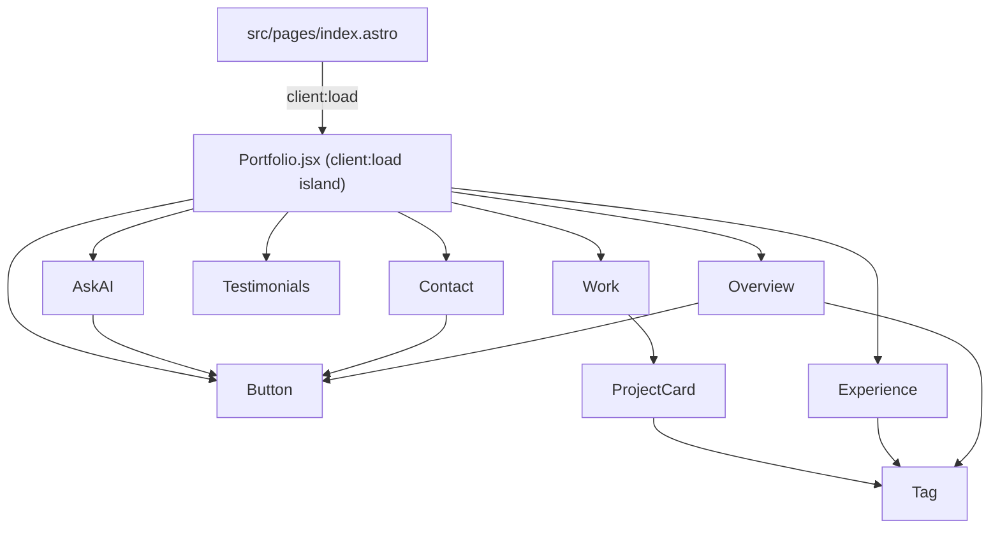

# Frontend-Modules

<!-- generated:start -->
## Astro + React Islands

The site is an [Astro](https://astro.build) app with **static output**. Astro renders pages to plain HTML at build time; interactivity is delivered as **React islands** — components that ship JS only where they're used. The whole app is a single client-side island: `src/pages/index.astro` mounts `<Portfolio client:load />`, so the `Portfolio` component (and everything it renders) hydrates in the browser on load. `src/pages/404.astro` is fully static apart from a `<Button>` link.

| Directive | Meaning | Used by |
|---|---|---|
| `client:load` | Hydrate the island immediately on page load | `Portfolio` (root island) |

## Component Tree

## Astro Pages & Layouts

| File | Role |
|---|---|
| `src/pages/404.astro` | 404 page — static not-found view with a back-home `<Button>` |
| `src/pages/index.astro` | Home page — renders `<Portfolio client:load />` inside `Base` |
| `src/layouts/Base.astro` | Layout — `<head>`, SEO/Open Graph, Google Analytics, fonts, `<slot />` |

## React Components

| Component | File | Imports | Hooks | Description |
|---|---|---|---|---|
| `Button` | `src/components/Button.jsx` | — | — | Pill button primitive — `primary`/`ghost` variants, renders `<a>` or `<button>` |
| `Portfolio` | `src/components/Portfolio.jsx` | `Button`, `Overview`, `Work`, `Experience`, `Testimonials`, `AskAI`, `Contact`, `portfolio` | `useState` | Root island — profile header, sticky tab bar, tab routing, footer |
| `ProjectCard` | `src/components/ProjectCard.jsx` | `Tag` | — | Project card — image, date, title, description, tag row; links out |
| `Tag` | `src/components/Tag.jsx` | — | — | Small pill tag used for skills and project technologies |
| `AskAI` | `src/components/tabs/AskAI.jsx` | `Button`, `portfolio` | `useState`, `useEffect`, `useRef` | Ask AI tab — chat panel wired to the live Lambda assistant (rate limited) |
| `Contact` | `src/components/tabs/Contact.jsx` | `Button` | — | Contact tab — prompt text + Email/LinkedIn/GitHub action buttons |
| `Experience` | `src/components/tabs/Experience.jsx` | `Tag`, `portfolio` | — | Experience tab — role timeline + categorized skills/tools tags |
| `Overview` | `src/components/tabs/Overview.jsx` | `Button`, `Tag`, `portfolio` | — | Overview tab — at-a-glance metrics grid + featured project spotlight |
| `Testimonials` | `src/components/tabs/Testimonials.jsx` | `portfolio`, `carousel` | `useState` | Testimonials tab — single-quote carousel with dots and arrows |
| `Work` | `src/components/tabs/Work.jsx` | `ProjectCard`, `portfolio` | — | Work tab — responsive grid of project cards |

## Logic & Data Modules

Framework-free JavaScript under `src/lib/` and `src/data/`. The `lib` modules are pure enough to unit-test directly with Jest (see the Testing page).

| Module | Exports | Description |
|---|---|---|
| `src/lib/carousel.js` | `nextIndex`, `prevIndex`, `initials` | Pure index math for wrap-around carousels (unit-tested) |
| `src/lib/chat.js` | `RATE_LIMIT_CONFIG`, `LAMBDA_URL`, `isRateLimited`, `recordRequest`, `getRemainingRequests`, `renderAssistantMarkdown`, `sendMessage` | Ask-AI Lambda client — rate limiting, markdown rendering, `sendMessage` |
| `src/data/portfolio.js` | `projects`, `skills`, `metrics`, `experience`, `testimonials`, `presetGroups`, `navItems` | Site data — projects, skills, metrics, experience, testimonials, navItems |
<!-- generated:end -->
