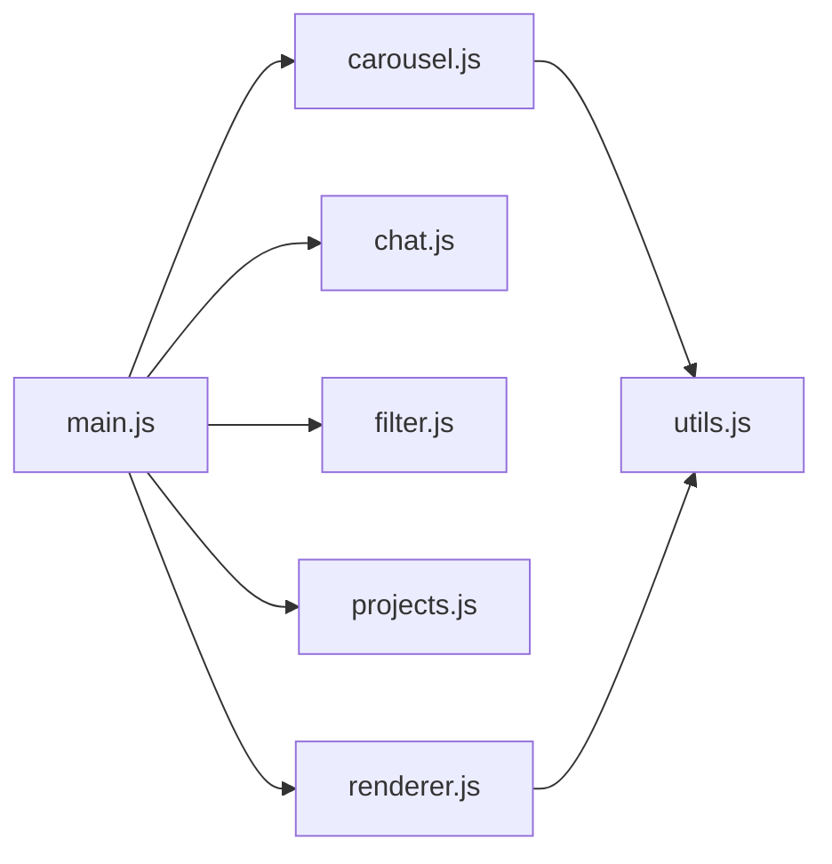

# Frontend-Modules

<!-- generated:start -->
## Module Dependency Graph

## Module Inventory

| Module | Exports | Description |
|---|---|---|
| `carousel.js` | `CAROUSEL_CONFIG`, `getNextIndex`, `getPrevIndex`, `getDotCount`, `getActiveDotIndex`, `getCounterText`, `initCarousel` | Testimonials carousel with dot navigation and counter |
| `chat.js` | `RATE_LIMIT_CONFIG`, `escapeHtml`, `isRateLimited`, `recordRequest`, `getRemainingRequests`, `formatMessage`, `initChat` | Lambda-backed chat widget with rate limiting and XSS protection |
| `filter.js` | `getFilteredVisibility`, `applyMaxVisible`, `getFeaturedVisibility`, `getFilterFromURL`, `getSortedIndices`, `initFilter` | Project card filtering logic and URL-based filter state |
| `main.js` | — | Application entry point — wires up all modules on DOMContentLoaded |
| `projects.js` | `projects`, `tags`, `TAG_LABELS`, `TAG_CATEGORIES` | Project data array, tag registry, and tag label/category maps |
| `renderer.js` | `createProjectCard`, `renderProjectCards`, `renderFilterButtons` | DOM rendering for project cards and filter buttons |
| `utils.js` | `getItemsToShow`, `isDesktop`, `formatProjectDate` | Shared utility functions (viewport, date formatting, etc.) |
<!-- generated:end -->
