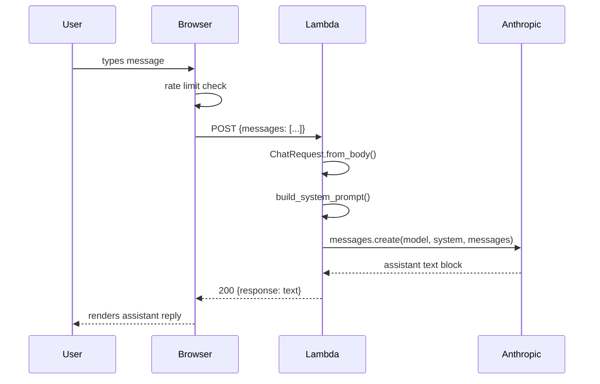
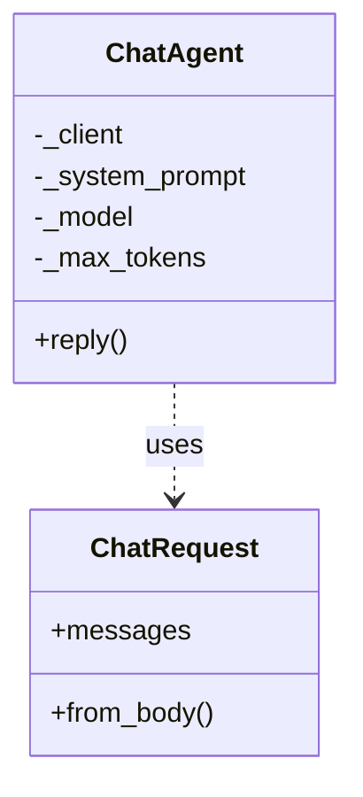

# Lambda-Chat-Agent

<!-- generated:start -->
## Lambda Chat Agent

The portfolio chat widget is powered by an AWS Lambda function that receives POST requests from the browser, validates the message, builds a system prompt from the knowledge base, and proxies the conversation to the Anthropic Claude Haiku model.

### Chat Request Sequence

### Class Diagram

## Dependencies

| Package | Source |
|---|---|
| `anthropic` | `lambda/requirements.txt` |

## Configuration

| Constant | Value |
|---|---|
| `MODEL_ID` | `claude-haiku-4-5-20251001` |
| `MAX_TOKENS` | `512` |
| `MAX_MESSAGE_LENGTH` | `1000` |
<!-- generated:end -->

<!-- claude:prose -->

<!-- claude:prose:end -->
