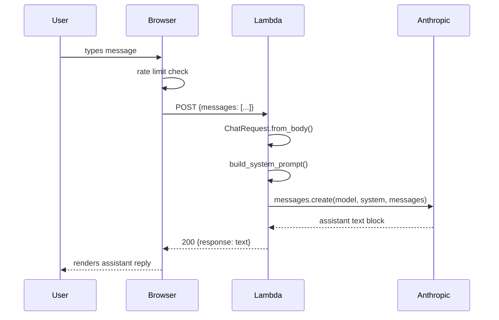
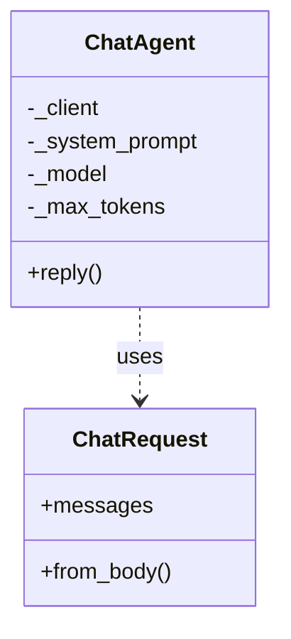

# Lambda-Chat-Agent

<!-- generated:start -->
## Lambda Chat Agent

The portfolio chat widget is powered by an AWS Lambda function that receives POST requests from the browser, validates the message, builds a system prompt from the knowledge base, and proxies the conversation to the Anthropic Claude Haiku model.

### Chat Request Sequence

### Class Diagram

## Dependencies

| Package | Source |
|---|---|
| `anthropic` | `lambda/requirements.txt` |

## Configuration

| Constant | Value |
|---|---|
| `MODEL_ID` | `claude-haiku-4-5-20251001` |
| `MAX_TOKENS` | `512` |
| `MAX_MESSAGE_LENGTH` | `1000` |
<!-- generated:end -->

<!-- claude:prose -->
## Design Rationale

### Dependency Injection Over Patching

The central design decision in `lambda_function.py` is that `ChatAgent` accepts an `anthropic.Anthropic` client as a constructor argument rather than instantiating one internally. This makes the agent fully testable without monkeypatching: every test in `lambda/tests/test_lambda.py` passes a mock client directly to `ChatAgent`, so the Anthropic SDK is never called during the test suite. The `handler` function uses a module-level `_default_agent` singleton (initialized lazily on first invocation) so the production path creates the real client only once per Lambda container lifetime, avoiding redundant initialization on warm invocations.

The same injection pattern applies to `handler_with_agent` — the production `handler` delegates immediately to `handler_with_agent(event, context, _default_agent)`, so tests can call `handler_with_agent` directly with a controlled agent, exercising the full HTTP parsing and error-mapping logic without network calls.

### Request Parsing and the Two-Body Shapes

`ChatRequest.from_body` accepts two JSON body formats. The original single-message format (`{"message": "..."}`) is supported for backward compatibility. The current format (`{"messages": [...]}`) carries the full conversation history, enabling multi-turn dialogue. When the `messages` array is present, `from_body` takes the last 10 messages, filters out any entry with an unrecognized role (only `"user"` and `"assistant"` are accepted), and discards entries with empty content. This sanitization step prevents prompt injection via malformed history and caps the context window sent to the API.

Validation failures raise `RequestError` (→ HTTP 400), not generic `Exception`, so the handler can distinguish client mistakes from server errors. A message exceeding 1,000 characters is rejected with a `RequestError` before any API call is made.

### Knowledge Base and System Prompt Construction

`build_system_prompt` assembles the system prompt from `knowledge_base.json` at startup. The knowledge base is a structured JSON document built by `scripts/build_knowledge_base.py` from the Markdown context files in `WebContent/context/`. It contains four top-level keys: `person` (bio, career journey, education, contact info), `skills` (9 categories with tool lists), `projects` (all portfolio projects with summaries, technologies, key results, and URLs), and `testimonials`.

The system prompt instructs Claude to answer concisely (2–3 sentences maximum), always include project URLs when referencing a project, resolve relative references ("that project", "the first one") from conversation history rather than from the numbered project list, and never fabricate information outside the knowledge base. The `CRITICAL` multi-turn instruction exists because early versions of the system incorrectly resolved "the last one" to the last item in the numbered list rather than the last item Claude mentioned — a subtle but consistently wrong behavior that required an explicit override.

### Error Hierarchy and HTTP Mapping

The three exception subclasses map cleanly to HTTP semantics:

| Exception | Cause | HTTP |
| --- | --- | --- |
| `RequestError` | Client sent invalid input | 400 |
| `ApiError` | Anthropic SDK raised `anthropic.APIError` | 502 |
| `EmptyResponseError` | API returned no `TextBlock` in content | 502 |

`ApiError` and `EmptyResponseError` both map to 502 (Bad Gateway) because the Lambda is acting as a proxy — these are upstream failures, not application bugs. The `handler_with_agent` catch-all `except Exception` maps to 500 and logs the full traceback, ensuring unexpected errors surface in CloudWatch without leaking details to the client.

### CORS Configuration

CORS headers are absent from `build_response` by design. The Lambda Function URL's built-in CORS configuration (set in AWS console or via Terraform) handles `OPTIONS` preflight and sets `Access-Control-Allow-Origin`. Putting CORS in application code would create a second place to maintain the allowed-origins list and would silently fail if the Function URL config were ever reset. The `OPTIONS` method handler in `handler_with_agent` returns an empty 200 so the preflight succeeds — the CORS headers are added by the Function URL layer, not the application.

### Knowledge Base Caching

`load_knowledge_base` uses a module-level `_knowledge_base` variable as an in-memory cache. On a warm Lambda invocation the JSON file is not re-read from disk; the cached dict is returned immediately. This is safe because `knowledge_base.json` is bundled with the deployment package and never changes at runtime — a new deployment is required to update the knowledge base, which necessarily creates a new Lambda container and clears the cache.
<!-- claude:prose:end -->
